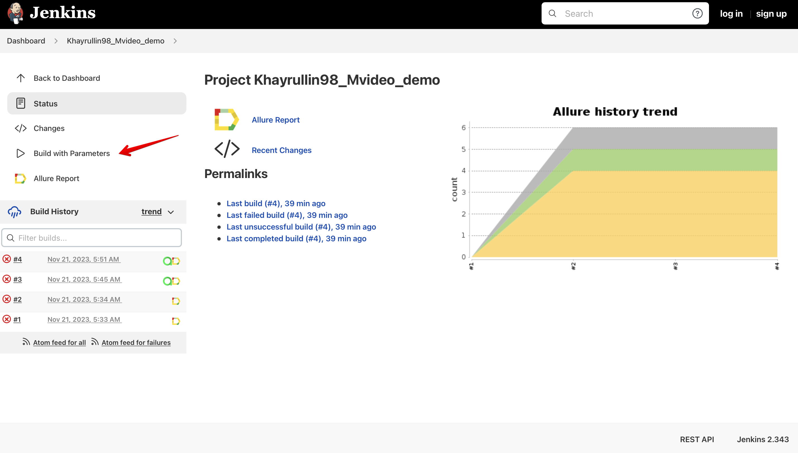
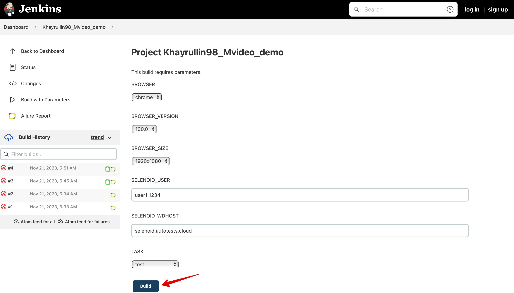
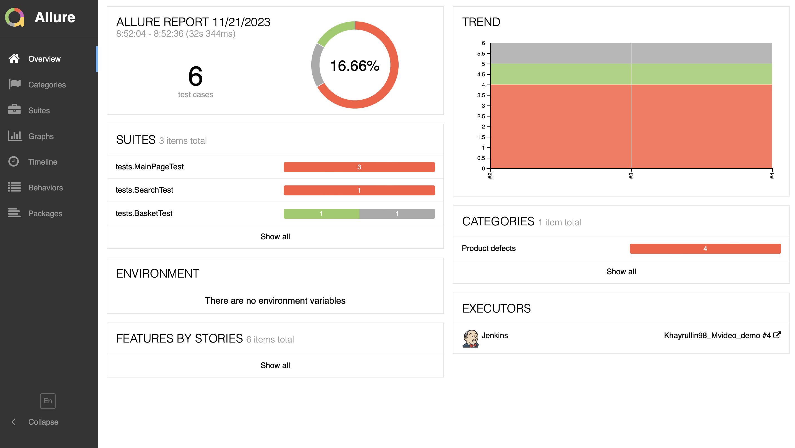
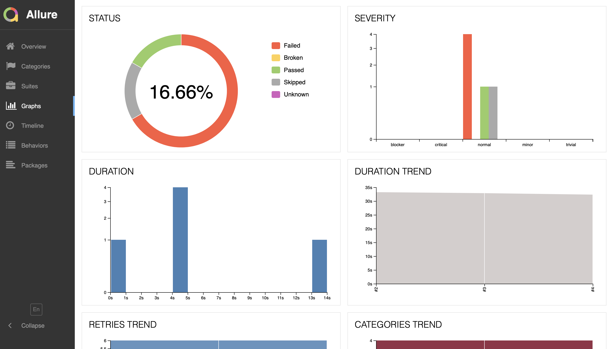
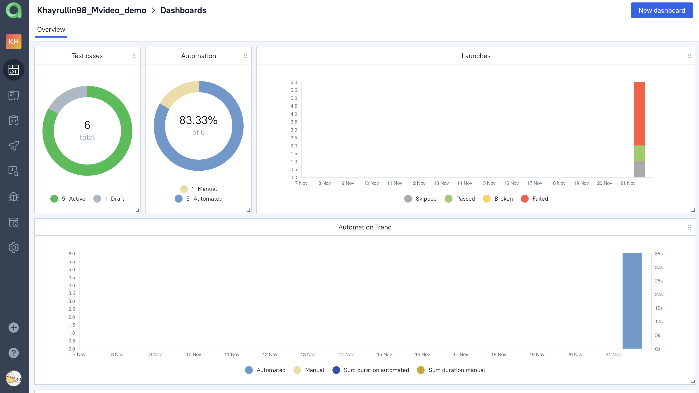
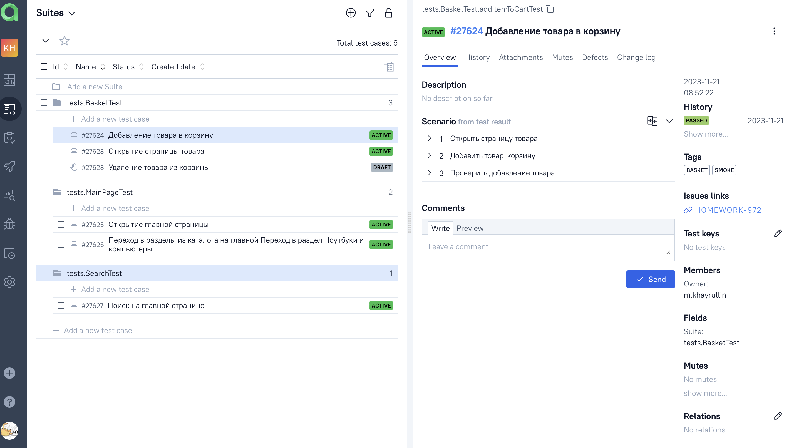
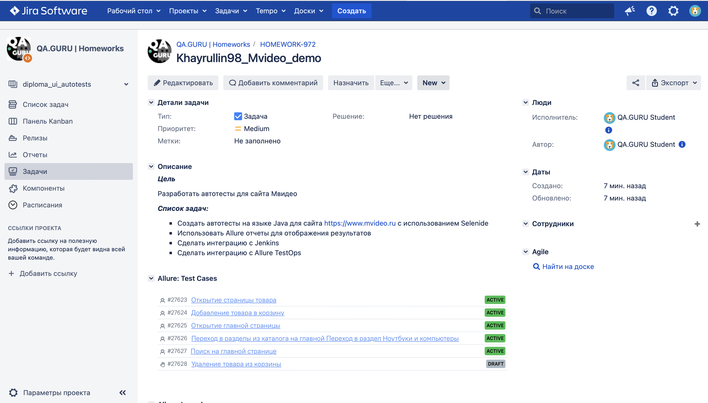
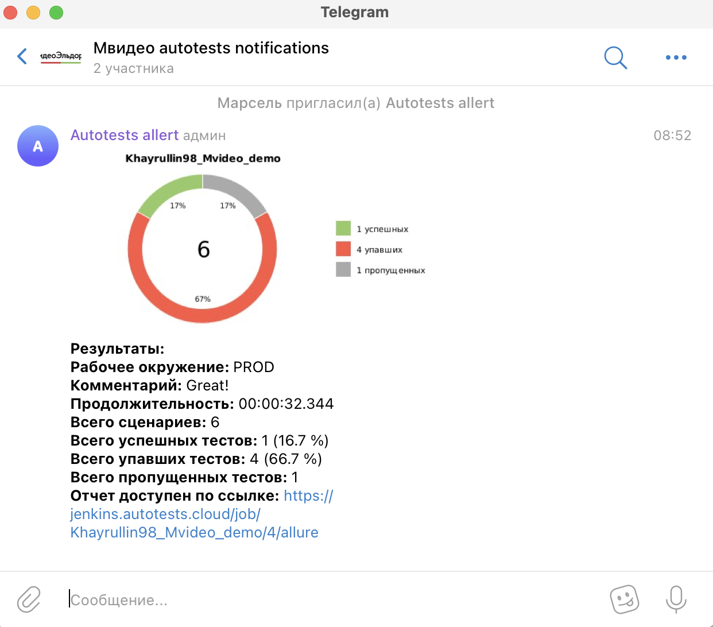
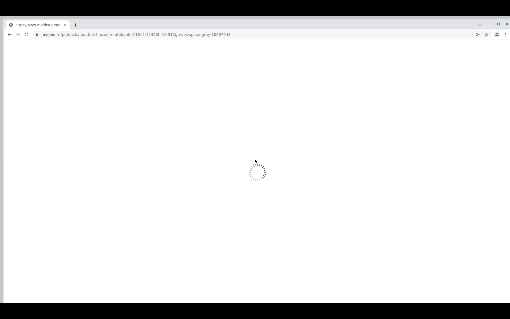

</h1>

# 
 Проект по автоматизации тестовых сценариев для  Мвидео 

## 🧾 Содержание:

- [Использованный стек технологий](#технологии)
- [Тестовые сценарии](#тестовые-сценарии)
- [Сборка в Jenkins](#сборка-в-jenkins)
- [Параметры сборки в Jenkins](#параметры-сборки-в-jenkins)
- [Интеграция с Allure Report](#allure-report)
- [Интеграция с Allure TestOps](#интеграция-с-allure-testops)
- [Интеграция с Jira](#интеграция-с-jira)
- [Уведомление в Telegram о результатах выполнения автоматизированных тестов](#уведомление-в-telegram-о-результатах-выполнения-автоматизированных-тестов)
- [Видеопример прохождения тестов Selenoid](#видеопример-прохождения-тестов-selenoid)

## 🔨 Использованный стек технологий:

- В данном проекте автотесты написаны на языке <code>Java</code> с использованием фреймворка для тестирования  <code>Selenide.</code>
- Для сборки проекта в среде IntelliJ IDEA используется <code>Gradle.</code>
- <code>JUnit 5</code> задействован в качестве фреймворка модульного тестирования.
- <code>Selenoid</code>используется для запуска браузеров в контейнерах Docker.
- Для удаленного запуска реализована джоба в <code>Jenkins</code> с формированием <code>Allure-отчета</code> и отправкой результатов в <code>Telegram</code> при помощи бота.
- Осуществлена интеграция с <code>Allure TestOps </code> и <code>Jira</code>.

## :clipboard: Тестовые сценарии
+ :white_check_mark: Открытие главной страницы
+ :white_check_mark: Переход в разделы из каталога на главной
+ :white_check_mark: Поиск товара на сайте
+ :white_check_mark: Добавление товара в корзину

##   Сборка в Jenkins

Для запуска сборки необходимо перейти на страницу [проекта Мвидео](https://jenkins.autotests.cloud/job/Khayrullin98_Mvideo_demo/)
в <code>Jenkins</code>, далее в раздел "Собрать с параметрами" (<code>Build with Parameters</code>), выбрать необходимые параметры и нажать
кнопку "Собрать" (<code>Build</code>).

## Параметры сборки

| Параметры          | Значение                                         |
|:-------------------|:-------------------------------------------------|
| BROWSER            | Браузер для запуска тестов (по умолчанию chrome) |
| BROWSER_VERSION    | Версия браузера       (по умолчанию 100.0)       |
| BROWSER_SIZE       | Размер окна браузера  (по умолчанию 1920x1080)   |
| SELENOID_USER      | Пользователь и пароль (по умолчанию user1:1234)  |
| SELENOID_WDHOST    | URL Selenoid          (selenoid.autotests.cloud) |
| TASK               | Задача на запуск      (по умолчанию test)        |

## Интеграция с Allure Report
При удаленном запуске тестов в <code>Jenkins</code>, автоматически генерируется [Allure Report](https://jenkins.autotests.cloud/job/Khayrullin98_Mvideo_demo/allure/)

##### Все, кроме одного теста падают, так как у Мвидео на сайте стоит ограничение по большому количеству запросов подряд за короткий промежуток времени.

##### [Overview](https://jenkins.autotests.cloud/job/Khayrullin98_Mvideo_demo/allure/#)

##### [Test details](https://jenkins.autotests.cloud/job/Khayrullin98_Mvideo_demo/allure/#behaviors)

##### [Graphs](https://jenkins.autotests.cloud/job/Khayrullin98_Mvideo_demo/allure/#graph)

### Интеграция с Allure TestOps

В отчете [Allure TestOps](https://allure.autotests.cloud/project/3832/dashboards) можно:

- Просматривать созданные тест-кейсы и чек-листы,
- Запускать ручные и автоматические тестовые прогоны,
- Заводить дефекты,
- Собирать статистику о проделанной работе.

##### [Allure TestOps Dashboard](https://allure.autotests.cloud/project/3832/dashboards)

##### [Ручные и автоматические тест-кейсы](https://allure.autotests.cloud/project/3832/test-cases?treeId=7480)

### Интеграция с Jira

Интеграция <code>Allure TestOps</code> с <code>Jira</code>, позволяет отображать в [задаче](https://jira.autotests.cloud/browse/HOMEWORK-972), открытой в <code>Jira</code>, какие тест-кейсы были написаны в
рамках задачи и результат их выполнения.

### Уведомление в Telegram о результатах выполнения автоматизированных тестов

После завершения сборки, автоматически отправляется отчет о результатах выполнения тестов в специально созданный [Telegram чат](https://t.me/+a4NqXqNcXpwwNmZi).

### Видеопример прохождения тестов Selenoid

В отчетах Allure для каждого теста создается не только скриншот, но и видео его прохождения.

  

